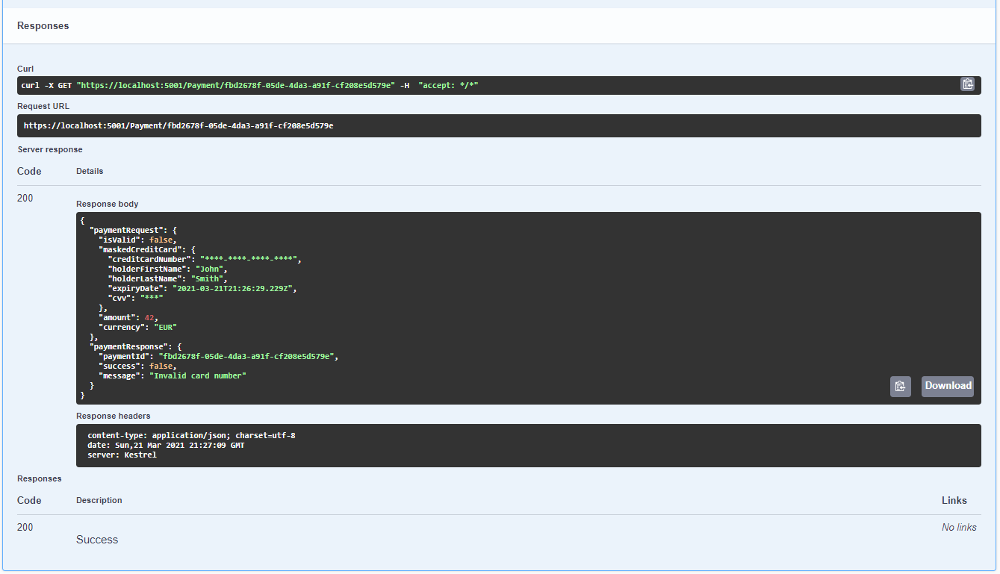

# CheckoutGateway
Here I have implemented a small PaymentGateway REST Api. 

# Application logging
For logging I used SeriLog for structured logging. 
Todo: use Logstash (https://www.elastic.co/logstash). 

# Application metrics
I have never had the chance to work with metrics directly before.

I would use something like https://docs.datadoghq.com/developers/metrics/types/?tab=count

It's interesting to know :
- counter of requests
- counter of invalid requests
- counter by currency
- counter of failures/sucesss
- counter by return status code
- etc. 

# Containerization
Deploying dotnet applications in azure is done without this step.
Otherwise I would use a docker's image from this page: https://hub.docker.com/_/microsoft-dotnet-aspnet

# Authentication
For API access by each merchant API keys would be used. 

1. If cloud, something similar to Azure's Apim's OCP Keys :
https://docs.microsoft.com/en-us/azure/cognitive-services/authentication?tabs=powershell

2. Or, develop some kind of AuthorizationHandler like : 
https://josef.codes/asp-net-core-protect-your-api-with-api-keys/ 

# API client
Swagger has been added for simple testing.
Ideally a web interface using Blazor, React, Vue or other frameworks can be developed with a material design.

# Build script / CI
msbuild in release mode step should be added to pipeline (or yaml)

# Performance testing

# Encryption
Idea: Implement something like Tokenization/P2PE (https://en.wikipedia.org/wiki/Point_to_Point_Encryption)

# Data storage
In this codebase I have abstracted the storing repostitory through the IRepository interface. 
Its only implementation is a in memory Dictionary storing the requests and responses.
Ideally this kind of data can be stored in a NoSQL database (CosmosDB, DocumentDb, MongoDb).

# TODO
- Add unit tests for PaymentRequestPreProcessor
- Add tokenization third party service for the credit card data transfer
- Specific credit card validators (Mastercard/Visa/etc.) 
- Use LogStash
