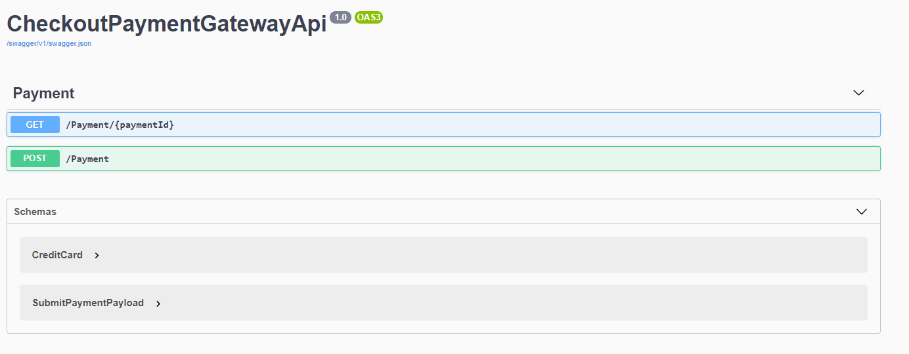

# CheckoutGateway
Here I have implemented a small PaymentGateway REST Api. 

# Application logging
For logging I implemented SeriLog for structured logging together Logstash. 

# Application metrics

# Containerization

# Authentication
For API access by each merchant API keys would be used. 

1. In Azure I use OCP Keys :
https://docs.microsoft.com/en-us/azure/cognitive-services/authentication?tabs=powershell
that are used directly in the API Gateway (Apim) before accessing our service. 
I would use that or something simmilar if I was deploying to the cloud. 

2. Develop some kind of AuthorizationHandler like : 
https://josef.codes/asp-net-core-protect-your-api-with-api-keys/ 
In this case I would need to persist the keys somewhere.

# API client

# Build script / CI

# Performance testing

# Encryption

# Data storage

# Anything else you feel may benefit your solution from a technical perspective.